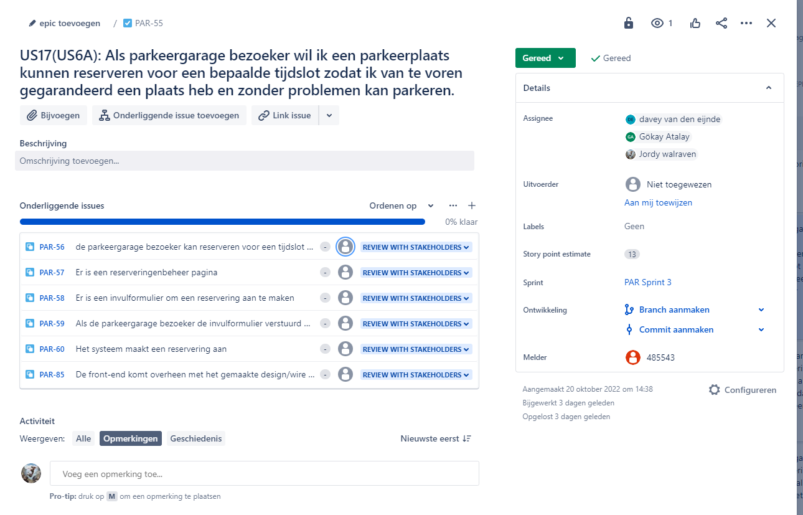
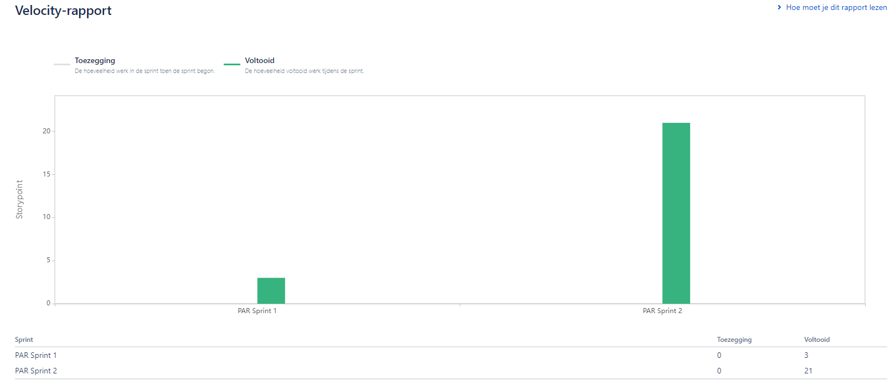

# Jira

## What is Jira?
Jira is a project management tool that is used to keep track of tasks and issues. Jira is used to keep track of tasks and issues. This is done by making a backlog for the project and then making a plan for the next sprint every couple of weeks. This way you can adapt to changes in the project.

## How do we use Jira?
In this project Jira has been a real learning process. At first we didnt really know how to use Jira to the fullest. We were not really using any of the build in features that Jira has, like asigning Story points, SubTask, Labels, Sprints and so on. We were just using Jira as a task list, like for example Trello. The way we used Jira didn't give the product owner a clear image of how things were being handled in our group. So after looking into Jira in sprint 3 we decided to rework the board and start using Jira the way it was intended to be used. We started using Labels, SubTasks, Story points and Sprints. At this point we are using a lot of the features that Jira has to offer. But we are still learning how to use things like Epics. I will keep updating this file as we learn more about Jira.

## User Stories
In Jira we use user stories to keep track of the tasks that need to be done. A user story is a short description of a feature that needs to be implemented. Each User Story has multiple sub Issues. This way we can assign a person to a sub issue and keep track of the progress of the user story. 

Before we start working on a userStory we first get it approved by the product owner. This way we can make sure that the user story is actually needed. We also let the product owner review and select the userStories. The product owner can get a clear image of how much work a certain task is by looking at the Story Points each user story has. In this project we gave every User story Story points by using PlanItPoker. This way our group can vote how much work they think a certain task is and we also make sure everybody understands the task.

In the later sprints we also gave every subTask Story points. We did this because this gives an even clearer image of how far a certain task has been completed. We can also use these story points to generate a burndown chart. Jira has a build in feature for this, but to use it you need to make sure you keep the board up to date. This is something we did not do in the first three sprint, but we did in the later sprints.

## Velocity
Velocity is a measurement of how much work a team can do in a sprint. This is done by adding up the story points of all the user stories that are completed in a sprint. This way you can see how much work you can do in a sprint. This is important because it gives you an idea of how much work you can do in a sprint. This way you can plan your sprints better. This makes it also clear to the product owner how much work our team can deliver in a sprint. 

At first we had no clue how to generate velocity graphs in Jira. So at first we didn't keep track of sprints and made artificial sprints within Jira. With these artificial sprints Jira had no clue what task belongs to what sprint. So in sprint 3 we reconfigured our whole Jira board to keep track of sprints. This way we can now generate velocity graphs and burndown charts.

