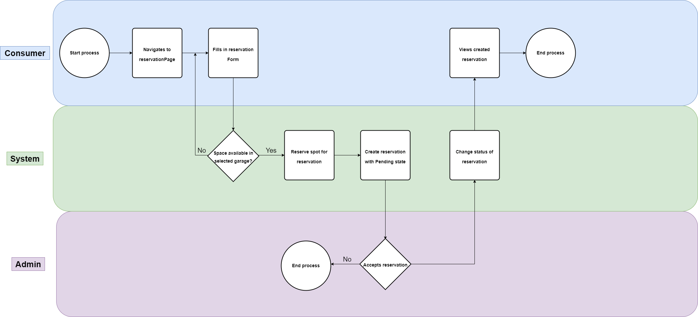
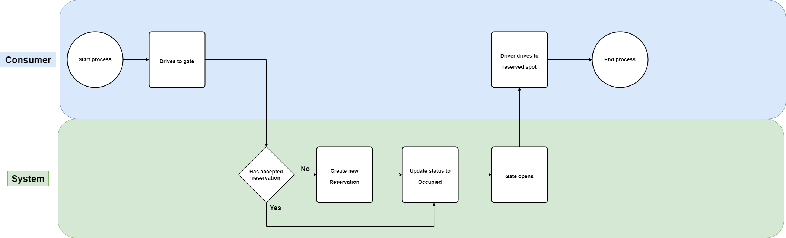

# Business processes

## What is a business process?

A business process is a collection of tasks by people with a specific sequence. A business process is often visualized as a flowchart. The benefits of using a business process are the improved customer experience and satisfaction, the increased efficiency and the reduced costs. A business process begins with a misson objective and ends with the result that the customer expects. The business process is the way to achieve the mission objective. In software business processes have become very important, because it visualizes the flow of your application and the interaction between the users and the application. The business process is the foundation of the software development process.

## Business processes within our group project
Our group project is all about reserving parking spaces, you can reserve spots, enter a garage or pay with our application. To visualize some of the processes withing our application I have created some flowcharts that show the processes. 

## Reserving a parking spot
In our application users are able to reserve a parking spot.

The process is divided in 3 different actor. The Consumer is the user using the application, the System is the application and the Admin is the person that accepts or denies reservations. The process begins with the consumer that wants to reserve a parking spot. The consumer can choose a parking spot and reserve it. The system will then check if this spot is available and if so it will reserve this spot for the consumer. The system will then send the reservation to the admin. The admin then has to either accept or deny the reservation. If the admin accepts the reservation the status of this reservation will be changed from Pending to Accepted. If the admin denies the reservation the status of this reservation will be changed from Pending to Denied. The user can then see the status of the reservation in the application.

 

## Arriving at the garage
When arriving at the garage the system first scans the license plate of the car, then it checks if there is an exisint reservation for this license plate. If there is no reservation the system will create a new reservation that has no end time. If a reservation is found it will put the status of the parking space on occupied. The gates of the garage will then open and the user can drive to their reserved parking spot.

## Leaving a garage
When leaving the garage the system will first scan the license plate of the car. The system will then calculate the total fees of the reservation based on the time passed since entering. The system will the create a new payment in Mollie. The gates will then open letting the user out witout paying. The parking spot status will also be changed to available The user can then pay their parking fees in the application when they get home. When the user has paid it will change the reservation status to paid

