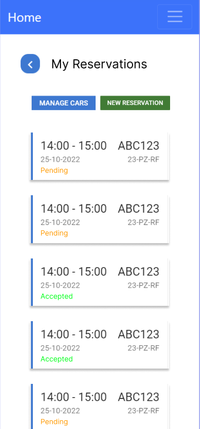
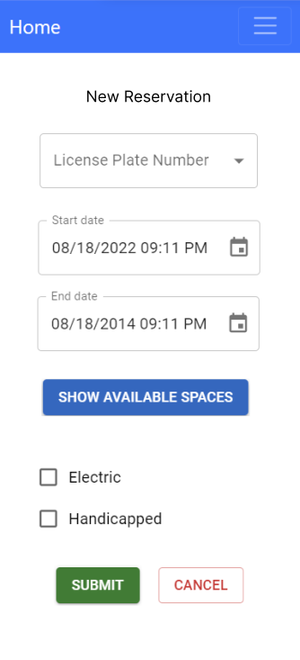
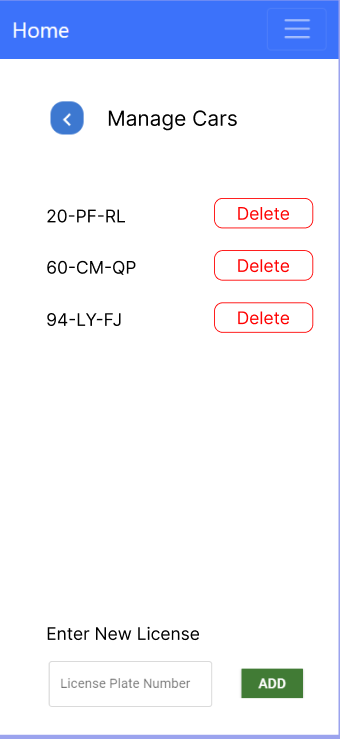
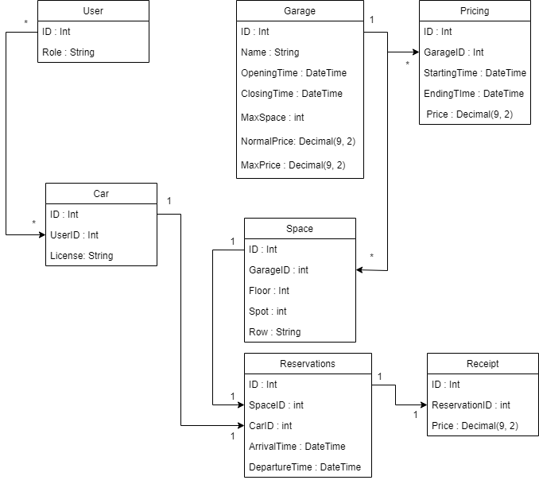
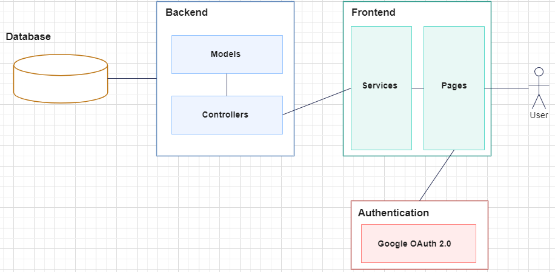
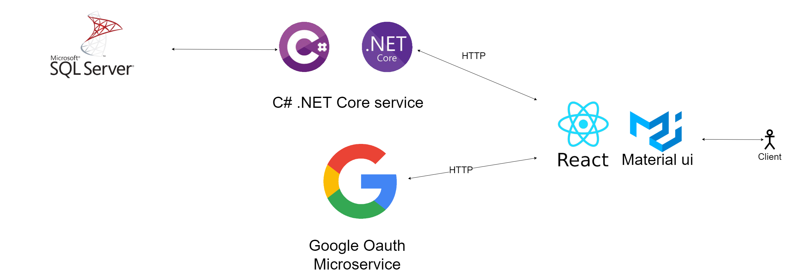

# Requirements and design

## 1. Requirements
We are building an application for a company called mediaan. They had multiple requirements for the application. Some of these requirements are:
- The application should be able to make reservations for multiple parking garages.
- The application should handle user data very carefully.
- The application should be able to handle multiple users.
- The application should be able to handle multiple cars.

Some non-functional requirements in this project are:
- The application should be easy to use.
- The application should be mobile friendly.
- The application must handle user data securely.

## 2. Design
We made multiple designs for the application. These designs are based on the requirements that we got from Mediaan. We made these designs in Figma. 

### Front-end designs
While making some frontend designs we asked the PO's quite often if they liked the design or if they wanted to change something. We did this to make sure all our choices were clear and and that our UI is user friendly. We made these designs for every page in the application and tried to stick to them as much as possible. Down below you can find 3 of these designs. The overview page got changed quite a bit after the first design, because the PO's didn't understand some of the features in this design.

Reservation OverViewPage            | Resrvation Creation Page                |Manage Cars Page
:----------------------------------:|:---------------------------------------:|--------------------
  |   |

 

## ERD diagram

For our database we made an ERD diagram. We made our application database first, meaning that the logic in our application is based on the database. Offcourse this doesnt mean that the database doesnt change during our development process, because we made a bunch of changes to this database. As you can see in the diagram we have 7 tables. 
You can see that we save very little UserData, as we tried to keep this data to the minimum. The user is connected to the license plate table, we made this a seperate table, because it's possible for a user to have more than 1 license plate bound to their account. This car table is then connected to the reservation table, because a reservation is for a specific car. 
 
 
Some other things that need to be mentioned is how we keep track of the hourly tariff of a garage. A garage in our diagramhas a normalPrice. This is the price that is charged when no other rule is applied, because we also have a Pricing table, in this pricing table certain time periods can get added to a garage. In this time period the hourly price of the garage will be the price that is in the pricing table. This is done to make sure that the garage can have different prices at different times of the day.

 

## Application flow

For our application we chose to make a distributed application. This means our application is split up into multiple microservices. We made 3 microservices for our application. These microservices are:
- Our consumer react frontend
- Our admin react frontend
- Our .net core backend
- Google oAuth
 
 
For login we decided to use google Oauth and not handle login ourselves. Because using a third party service for this is way more secure, this login services is completely handled by google, and seperated from our application. This means that we dont have to worry about storing passwords or anything like that.

## Technology
For our application we are using distributed systems. For our front-end we use React with multiple styling libraries.
The main styling libraries we are using are MaterialUI, and bootstrap. These libraries are used to make our application look good, and it takes less time to implement these libraries then to do it ourselves.
 For our backend we are using Asp.Net Core. And for our data base we are using Microsoft SQL.
We are also using a third party authentication service called OAuth2. This service is used to authenticate users. And to make sure that only the right users can access the right data. You can find a design with the technology that we are using below:

