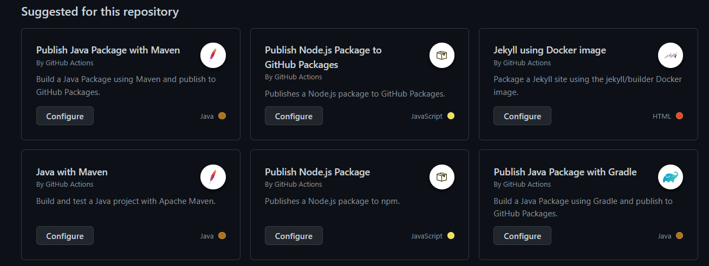

# Github Actions

To reach all the outcomes for my userstories I need to make sure my code is tested and puslished to docker hub. We don't want to do this manually everytime we make a change to our code. This is where Github Actions comes in. Github Actions is a feature that allows you to automate your workflow. You can use it to run tests, build your code, publish your code to docker hub and much more. In this project I will use it to build,run and test my code, other than that I will also generate a static code analysis report and publish my code to docker hub.

## Creating our workflow file
To  start creating our workflow we need a .yml file, luckily we don't have to make these from scratch, because github already has a bunch of templates for us to use. To create a new workflow file we need to go to our repository and click on the actions tab. You will then see all the templates that are available like so:


I am using react in my frontend so I will be using the Node.js Package. Click on configure and it will take you to a page where you can edit the workflow file. Github will also create a new folder in you repository where you can place all your workflow files.


## Structure of my workflow file
My completete workFlow file looks like this:
```yml

name: CI/CD Push

on:
  push:
    branches: [ "main","development" ]
  pull_request:
    branches: [ "main","development"  ]
   
   
defaults:
  run:
    working-directory: s3-frontend

jobs:
  build:
    runs-on: ubuntu-latest

    strategy:
      matrix:
        node-version: [ 18.x]
        # See supported Node.js release schedule at https://nodejs.org/en/about/releases/
    steps:
    - uses: actions/checkout@v3
    - name: Use Node.js ${{ matrix.node-version }}
      uses: actions/setup-node@v3
      with:
        node-version: ${{ matrix.node-version }}
        cache: 'npm'
    - run: npm i
    - run: npm run build --if-present
    - run: npm test -- --coverage

    - name: SonarCloud Scan
      uses: SonarSource/sonarcloud-github-action@master
      env:
        GITHUB_TOKEN: ${{ secrets.GITHUB_TOKEN }} 
        SONAR_TOKEN: ${{ secrets.SONAR_TOKEN }}


  dockerhub:
      name: Dockerhub Build and Push
      runs-on: ubuntu-latest
      if: ${{ github.event_name == 'push' }}
      steps:
        - uses: actions/checkout@v3
  
        - name: Set up QEMU
          uses: docker/setup-qemu-action@v2
        -
          name: Set up Docker Buildx
          uses: docker/setup-buildx-action@v2
        -
          name: Login to Docker Hub
          uses: docker/login-action@v2
          with:
            username: ${{ secrets.DOCKER_USERNAME }}
            password: ${{ secrets.DOCKER_PASSWORD }}
        -
          name: Build and push
          uses: docker/build-push-action@v3
          with:
            context: ./s3-frontend
            push: true
            tags: jordywalraven/signify-app:frontend
```

This file might look a bit overwhelming at first but I will explain what each part does, and you will see that it isnt really that hard.

### On
The on section is where we define when our workflow should run. In this case I want it to run when I push to the main or development branch and when I create a pull request to the main or development branch. This way I can make sure that my code is tested before it is merged into the main branch.

### Defaults
The defaults section is where we define the default settings for all the jobs in our workflow. In this case I am setting the working directory to s3-frontend. This is the folder where my frontend code is located.

### Jobs
Jobs are the individual tasks that we want to run. In this case I have two jobs, one for building and testing my code and one for building and pushing my code to docker hub.

Let's first go over the first job which is the build job. This job will run on ubuntu-latest and will use the node version 18.x. It will then run the following steps:

1. Checkout the code

    This step will checkout the code from the repository and put it in the working directory.
    <br>
    <br>
2. Use Node.js ${{ matrix.node-version }}

    This step will install node.js and set the node version to the one we defined in the matrix.
    <br>
    <br>
3. Run npm i

    This step will install all the dependencies for our project.
    <br>
    <br>
4. Run npm run build --if-present
    
    This step will build our project.
    <br>
    <br>
5. Run npm test -- --coverage
    
    This step will run our tests and generate a coverage report.
    <br>
    <br>
6. SonarCloud Scan
        
    This step will generate a static code analysis report and send it to sonarcloud.
    <br>
    <br>

We then have a second job which is the dockerhub job. This job will run on ubuntu-latest and will only run when we push to the main or development branch. This job will run the following steps:

1. Checkout the code

    This step will checkout the code from the repository and put it in the working directory.
    <br>
    <br>
2. Set up QEMU
    
    This step will set up QEMU needed for creating a docker image.
    <br>
    <br>
3. Set up Docker Buildx
        
    This step will set up Docker Buildx needed for creating a docker image.
    <br>
    <br>
4. Login to Docker Hub
        
    This step will login to docker hub using the credentials we defined in the secrets.
    <br>
    <br>
5. Build and push
            
    This step will build our docker image and push it to docker hub.
    <br>
    <br>

### Secrets
To make sure that our credentials are not visible in our code we can use secrets. Secrets are environment variables that we can use in our code. To create a secret we need to go to our repository and click on settings. Then click on secrets and click on new repository secret. You can then create a new secret and give it a name. You can then use this secret in your code by using the following syntax: ${{ secrets.SECRET_NAME }}.

### Sonarcloud
To get more explanation about sonarCloud click [here](./SonarCloud.md)

### Docker
To get more explanation about dockerhub click [here](./DockerHub.md)
