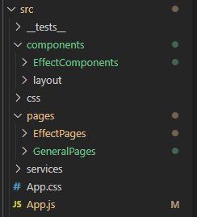

# React Structure

## Table of contents

1. [General structure](#general-structure)
2. [Pages](#pages)
3. [Components](#components)
4. [Canvas Components](#canvas-component)
5. [Tests](#tests)
6. [How to use the userContext in your own page](#how-to-use-the-usercontext-in-your-own-page)


## General structure
My structure is based on the structure that is given by the create-react-app command. The structure I use looks like the following:



## App.js
The App.js file is the main file of the application. This file is the first file that is loaded when the application is started. In this file you can find multiple routes that are used to navigate through the application. The routes are defined in the following way:

```javascript
<Route exact path="/sign-up" element={<LoginPage  />}/>
```

This means that the Login page will be rendered when the user navigates to the /sign-up route. 

The App.js file also contains the context provider. The context provider is used to share data between components. The context providers is defined in a different file, but the app.js manages this context. The context provider is used in the following way:
```javascript
<userContext.Provider value={value}>
 ```
 value is the data that is shared between the components. In this case the value consists of a user object, userLogin and userLogout function. The value is defined in the following way:
 ```javascript
  const value = {
    user: stateUser,
    userLogin: loginUser,
    userLogout: logoutUser,
  };
  function loginUser(stateCredentials) {
    setStateUser(service.parseJwt(stateCredentials));
    service.setUser(stateCredentials);
  }
  function logoutUser() {
    setStateUser(null);
    service.logoutUser();
  }
 ```

## Pages
The pages folder contains all the pages that are used in the application. This folder is split up in the different features used in my application. For example there is an effectPages folder, this folder holds all the pages that are related to effects. 
These pages will be rendered by the paths configured in the App.js file.

## Components
This components folder is very similar to the pages folder structure wise, but this folder holds the components that are used in the pages. The components are also split up between the different features in the application.

## Canvas Component
The canvas component is a very special component. This component modifies the uploaded html so that it can be used inside the website. The canvas component watches for changes in a file input field. When a file the canvas component will be triggered and modify the html. The canvas component also has a htmlStringCallback. In this callback the canvas component will return the modified html so that it can be posted to the backend. The canvas component is used in the following way:
```javascript
      <Canvas
        fileInput={html}
        htmlStringCallback={SetString}
        finalString={htmlString}
      ></Canvas>
```
The fileInput is the file input field that is used to upload the html file. The htmlStringCallback is the callback that is used to return the modified html. The finalString expects the html to be rendered in the canvas. Normally this would be the html that is returned by the htmlStringCallback.

## Tests 
This test folder holds all the unit tests that are used in the application. When adding a new feature make sure unit tests are in place! 

 ## How to use the userContext in your own page?
To use the userContext in your own page you need to import the userContext. After doing this you can asign the context to a variable, after doint this this variable can be directly accessed to get the data that is shared between the components. The following code shows how to use the userContext in your own page:


```javascript
    import { userContext } from "../../userContext";

    const User = React.useContext(userContext);
    //If for example you want to get the UserSub from the userContext you can do this:
    const UserSub = User.user.sub;
```


