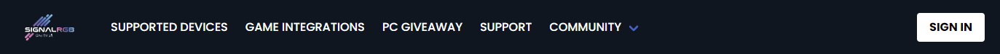
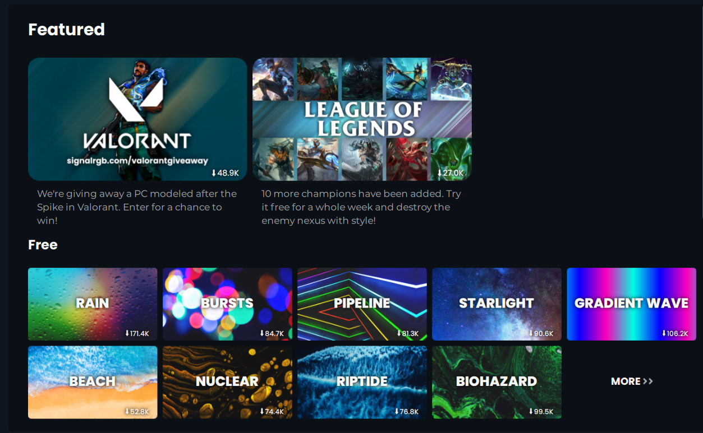

# How can the UX of signify match the wishes of the SignalRGB community?

## What is SignalRGB?
SignalRGB is a single piece of software that lets you control and sync your RGB lighting. It's a free application that you can use on Windows. SignalRGB uses a html canvas to draw effects. You can then place your hardware anywhere on this canvas and signalRGB will send the correct color to your hardware. There is also an effect store, in this effect store you can view multiple effects and download them from there.

## What are the main UI properties of SignalRGB?

### Color pallette: 
SignalRGB has a very dark color pallete with some very high saturated gradients sprinkled in. The main color of the application is dark blue with pink and light blue accents. This color pallete is also synced between the desktop application and their website. The main color palette looks consists of the following colors:
-  `#060B11`
-  `#212D3A`
-  `#688CC6`
-  `#DE81BD`
 
### General layout:
SignalRGB has a simple layout with a sidebar on the left and the page content on the right.

This sidebar has is split up in mutiple small topics, and covers all the main features of signal

 

The website uses a different format, as here the sidebar is on the top and the page content is on the bottom.

### Responsiveness:
SignalRGB is only slightly responsive. Everything does scale down, but the sidebar will take over the majority of the applcation if you go down to a mobile size. 

### Home page
The homepage consists of a bunch of effect displays. The effects are divided into mutiple subcategories like free effects, pro effects. 
When clicking on these you get redirected to a page that also has sub categories, like new or updated.

## How would SignalRGB users design the homepage of signify?
To get a view of how the user thinks of the current homepage, and how they would like to see the UI of signify I made a survey. 
This survey consists of 4 questions:

- What do you think of the color palette that signalRGB uses? 
- What do you think about the big effect images on the homepage of signalRGB?
- Would you like to see what the effects look like before you download them, and why?
- If the effect store would be a (third party) website, what would you change about the UI?

You can see the answers on this survey [here](https://docs.google.com/spreadsheets/d/1WLfC2b9om17OcXw9PdHgblQ90HuG-ggkQgZ4sWN9d5g/edit#gid=747309698)

Summarized result:

90% of the users like the color palette that signalRGB uses.

Most people like the images on the homepage of signal, but don't like that the images don't represent the effects that well. 

Most people like the idea of previewing an effect before they download it, altough it's not a necessary feature. 

For the last question the results differ quite a bit. Some of the key features that need to be added to the UI are:
- Preview on mouse hover
- Don't make mutiple small sections of effects per genre, but instead show everything and let the user filter with for example tags or color.

## Conclusion
From the survey we can see that the community really likes the color palette that signalRgb uses. This is one of the general things that is liked by almost everyone in the community. Another thing the community really likes is how the effects get shown with these big images, but they don't like the images themselves. In general they think that the images dont represent the effect that well, and that showing the real effect makes searching for a good effect way easier. Another the thing the community really likes is the ease of use and the size of the buttons.
